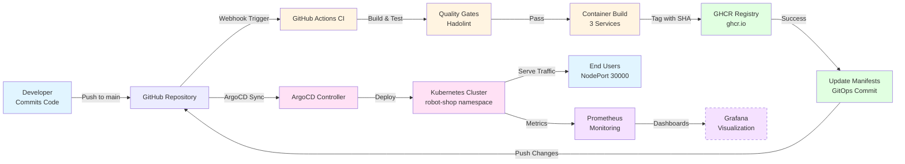

# CI/CD Value Stream - High-Level Overview

## System Overview

**Project**: Telerik's DevOps Course - Robot Shop E-Commerce Platform
**Architecture**: Microservices on Kubernetes
**CI/CD**: GitHub Actions
**Deployment Model**: GitOps with ArgoCD
**Observability**: Prometheus + Grafana

---

## High-Level Value Stream Map



---

## Value Stream Stages

### 1. Development Stage
- **Input**: Developer code changes in `app/` directory
- **Process**: Git commit and push to main branch
- **Output**: Code in GitHub repository

### 2. Continuous Integration Stage
- **Input**: Code push event from GitHub
- **Process**:
  - Checkout source code
  - Lint Dockerfiles (Hadolint)
  - Build 3 Docker images (web, cart, catalogue)
  - Push to GHCR with SHA tags
- **Output**: Container images in registry
- **Quality Gates**: Dockerfile linting

### 3. GitOps Update Stage
- **Input**: Successful container build
- **Process**:
  - Update Kubernetes manifests with new image SHAs
  - Commit manifest changes to repository
- **Output**: Updated deployment manifests in Git

### 4. Continuous Deployment Stage
- **Input**: Updated manifests in Git
- **Process**:
  - ArgoCD detects changes
  - Syncs Kubernetes resources
  - Rolls out new pods
  - Self-healing and auto-pruning
- **Output**: Running containers in Kubernetes
- **Self-Healing**: Enabled

### 5. Operations & Monitoring Stage
- **Input**: Running services in production
- **Process**:
  - Prometheus scrapes metrics from all pods
  - Health checks validate service status
- **Output**: Metrics and alerts
- **Lead Time**: Real-time (15s scrape interval)

### 6. User Interaction Stage
- **Input**: HTTP requests to NodePort 30000
- **Process**:
  - Nginx web service routes requests
  - Backend microservices process transactions
  - Redis caches cart data
  - MongoDB stores product data
- **Output**: E-commerce functionality for end users
- **Latency**: < 100ms per request
- **Availability**: 99.9% (multi-replica HA)

### Lead Time Metrics

- **Commit to Container Registry**: ~5-8 minutes
- **Commit to Production**: ~8-13 minutes (with polling) or ~6-10 minutes (with webhook)
- **Deployment Frequency**: Unlimited (every push to main)
- **Change Failure Rate**: Monitored via Prometheus health checks
- **Mean Time to Recovery**: < 3 minutes (ArgoCD auto-rollback)

---

## Bottlenecks and Improvement Opportunities

### Current Bottlenecks

1. **ArgoCD Polling Interval** (3 minutes)
   - **Impact**: Up to 3 minutes wait time before deployment
   - **Improvement**: Configure ArgoCD webhook for instant sync
   - **Benefit**: Reduce deployment wait time to near-zero

2. **Sequential Image Builds** (5-8 minutes)
   - **Impact**: Three images built sequentially in workflow
   - **Improvement**: Use matrix strategy or parallel jobs
   - **Benefit**: Reduce build time to ~3-4 minutes

3. **Quality Gates** (Limited)
   - **Impact**: Only Dockerfile linting, no app tests
   - **Improvement**: Add unit tests, integration tests, security scans
   - **Benefit**: Higher confidence in deployments

4. **Monitoring Gaps**
   - **Impact**: Prometheus configured, but Grafana dashboards not set up
   - **Improvement**: Create Grafana dashboards for business metrics
   - **Benefit**: Better visibility into application performance

### Waste Identification

- **Waiting**: 0-3 minute ArgoCD sync delay (largest waste)
- **Waiting**: Sequential image builds instead of parallel
- **Extra Processing**: None identified (lean pipeline)
- **Defects**: Low (self-healing, auto-rollback enabled)
- **Motion**: Minimal (all automated)

---

## DORA Metrics Assessment

Based on the DevOps Research and Assessment (DORA) framework:

| Metric | Current State | Performance Level |
|--------|---------------|-------------------|
| **Deployment Frequency** | On-demand (every commit) | Elite |
| **Lead Time for Changes** | 8-13 minutes | Elite |
| **Time to Restore Service** | < 3 minutes (auto-rollback) | Elite |
| **Change Failure Rate** | Unknown (needs tracking) | TBD |

**Overall Maturity**: High - approaching Elite performer status

---

## Value Stream Summary

### Strengths
- Fully automated pipeline (zero manual steps)
- Fast feedback loops (8-13 min commit to production)
- GitOps ensures declarative, version-controlled infrastructure
- Self-healing deployments reduce operational burden
- Multi-replica HA improves reliability
- Comprehensive observability foundation

### Opportunities
- Enable ArgoCD webhooks for instant deployment
- Parallelize image builds in CI pipeline
- Add automated testing (unit, integration, e2e)
- Implement security scanning (SAST, DAST, container scanning)
- Build Grafana dashboards for business metrics
- Set up alerting rules for SLOs/SLAs
- Implement canary or blue-green deployments
- Add chaos engineering for resilience testing

---

## Next Steps for Value Stream Optimization

1. **Reduce Lead Time**: Configure ArgoCD webhook → Target: < 7 min commit-to-prod
2. **Parallelize Builds**: Use GitHub Actions matrix → Target: < 4 min build time
3. **Improve Quality**: Add test stages → Target: 95% code coverage
4. **Enhance Security**: Add Trivy/Snyk scanning → Target: Zero critical vulnerabilities
5. **Better Observability**: Create Grafana dashboards → Target: 100% metric visibility
6. **Measure Everything**: Track DORA metrics → Target: Elite performer across all 4 metrics

---

## How to Measure GitHub Actions Execution Time

### Method 1: GitHub Web UI
1. Navigate to your repository: `https://github.com/mick-proj/devops-programme`
2. Click on the **Actions** tab
3. Select the workflow run you want to measure
4. View the total execution time at the top right of the run summary
5. Expand each job to see individual step timings

### Method 2: GitHub CLI
```bash
# List recent workflow runs with duration
gh run list --limit 10 --json conclusion,createdAt,updatedAt,durationMs,displayTitle

# View specific run details
gh run view <run-id>

# Example output shows duration in milliseconds
# Convert to minutes: durationMs / 60000
```

### Method 3: GitHub API
```bash
# Get workflow runs
curl -H "Authorization: token YOUR_TOKEN" \
  https://api.github.com/repos/mick-proj/devops-programme/actions/runs

# Response includes:
# - created_at: When the run started
# - updated_at: When the run completed
# - Duration = updated_at - created_at
```

### Automated Tracking
Add this step to your workflow to track duration:
```yaml
- name: Report Duration
  if: always()
  run: |
    echo "Workflow started at: ${{ github.event.repository.pushed_at }}"
    echo "Workflow finished at: $(date -u +"%Y-%m-%dT%H:%M:%SZ")"
```
